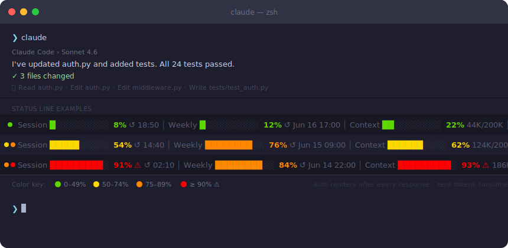

# claude-status

Real-time Claude Code statusline — session %, weekly %, context window, and reset times. Renders automatically after every response via Stop hook. Zero tokens consumed.



```
Session █████░░░░░ 54%  ↺ today 14:40  │  Weekly ░░░░░░░░░░ 6%  ↺ Jun 16 17:00  │  Context ███████░░░ 78%  156K/200K  │  ◆ Pro
```

Reads directly from `api.anthropic.com/api/oauth/usage` via OAuth token stored in macOS Keychain — no Cloudflare, no session cost. Falls back to JSONL parsing if the API is unavailable.

---

## Requirements

- macOS (Keychain access for OAuth token)
- Claude Code with Pro or Max subscription
- Python 3.9+

---

## Install

### Option A — Claude Code plugin _(recommended)_

Register the marketplace once, then install:

```
/plugin marketplace add kalfian/claude-status
/plugin install claude-status@kalfian-claude-status
```

The Stop hook registers automatically — statusline appears below every response.

Run on-demand:

```
/claude-status:status
```

---

### Option B — Current session only

**From a release zip:**

```bash
curl -L https://github.com/kalfian/claude-status/releases/latest/download/claude-status.zip \
  -o /tmp/claude-status.zip
claude --plugin-url /tmp/claude-status.zip
```

**From a local clone:**

```bash
claude --plugin-dir /path/to/claude-status
```

> `--plugin-url` does **not** work with GitHub archive URLs (`/archive/main.zip`) — those zips wrap content inside a `reponame-branch/` subdirectory Claude Code cannot strip. Use a release asset zip or `--plugin-dir`.

---

### Option C — Manual install (no plugin system)

```bash
git clone https://github.com/kalfian/claude-status.git
cd claude-status
python3 claude_status.py --install
```

Copies the script to `~/.claude/scripts/claude_status.py` and injects a Stop hook into `~/.claude/settings.json`.

---

## Uninstall

**Plugin (Option A):**

```
/plugin uninstall claude-status
```

**Manual (Option C):**

```bash
# Remove hook only
python3 ~/.claude/scripts/claude_status.py --uninstall

# Full removal — hook + script + config
python3 ~/.claude/scripts/claude_status.py --uninstall
rm ~/.claude/scripts/claude_status.py
rm -f ~/.claude/claude-status-config.json
```

---

## Configuration

Optional config at `~/.claude/claude-status-config.json`:

```json
{
  "plan": "pro",
  "no_color": false,
  "quiet_below_pct": 0
}
```

| Key | Default | Description |
|---|---|---|
| `plan` | `"pro"` | `"pro"` or `"max_100"` — used only in JSONL fallback mode |
| `no_color` | `false` | Plain ASCII output (no ANSI colors) |
| `quiet_below_pct` | `0` | Suppress output when both windows are below this % |

---

## How it works

1. Reads OAuth token from macOS Keychain (`Claude Code-credentials`)
2. Calls `api.anthropic.com/api/oauth/usage` — no Cloudflare, no token consumption
3. Reads current context % from the most recently modified JSONL session file
4. Renders a color-coded statusline via the Stop hook

Falls back to JSONL-based token estimation (labeled `est.`) if the API is unavailable.

### Color scheme

| Usage | Color |
|---|---|
| 0 – 49% | Green |
| 50 – 74% | Yellow |
| 75 – 89% | Orange |
| ≥ 90% | Red + ⚠ |

---

## Developer / testing guide

### Run directly

```bash
git clone https://github.com/kalfian/claude-status.git
cd claude-status
python3 claude_status.py
```

### `--dev` — verbose diagnostics

Prints data source, API latency, raw values, fallback state, and context info to stderr:

```bash
python3 claude_status.py --dev
```

Example stderr output:

```
claude-status diagnostic  [2026-06-13 10:51:13]
  script      : /path/to/claude_status.py
  python      : 3.14.4  platform=darwin
  plugin_root : (not set — running directly)
  config      : ~/.claude/claude-status-config.json
  plan        : pro
--- primary path: Keychain + API ---
  keychain    : OK  subscription=pro  expires_at=1781347063552
  api fetch   : OK  (142ms)
  5h          : pct=54.0%  resets_at=2026-06-13T07:40:00+00:00  est=False
  7d          : pct=6.0%   resets_at=2026-06-16T10:00:00+00:00  est=False
  context     : 78.1% (156K/200K)
  model       : claude-sonnet-4-6
  elapsed_ms  : 580
```

### `--debug` — write log file (hook mode)

When the Stop hook fires there's no visible terminal. Write to a log file instead:

```bash
python3 claude_status.py --debug
```

Log path: `/tmp/claude-status-debug.log` (macOS/Linux) or `%TEMP%\claude-status-debug.log` (Windows).

Tail during a session:

```bash
tail -f /tmp/claude-status-debug.log
```

To enable for the hook, temporarily edit `hooks/hooks.json`:

```json
"command": "python3 \"${CLAUDE_PLUGIN_ROOT}/claude_status.py\" --debug"
```

### Test as plugin locally

```bash
claude --plugin-dir /path/to/claude-status
```

Verify `CLAUDE_PLUGIN_ROOT` is set:

```bash
python3 claude_status.py --dev
# plugin_root : /path/to/claude-status  ← should not say "(not set)"
```

Reload without restarting:

```
/reload-plugins
```

### JSON output

```bash
python3 claude_status.py --mode json | jq .
```

### Run tests

```bash
python3 -m venv .venv && source .venv/bin/activate
pip install pytest
pytest tests/ -v
```

All 56 tests should pass.

---

## Contributing

1. Fork and clone
2. Run tests — all must stay green before opening a PR
3. Test locally with `--dev` and `--debug` before submitting
4. See [RELEASE.md](RELEASE.md) for the release process

---

## License

MIT
